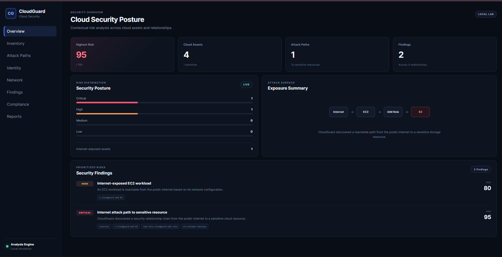
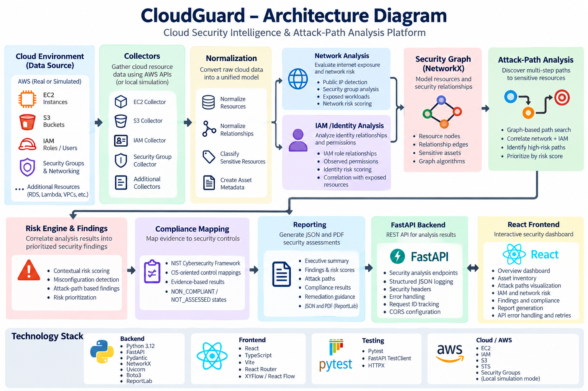
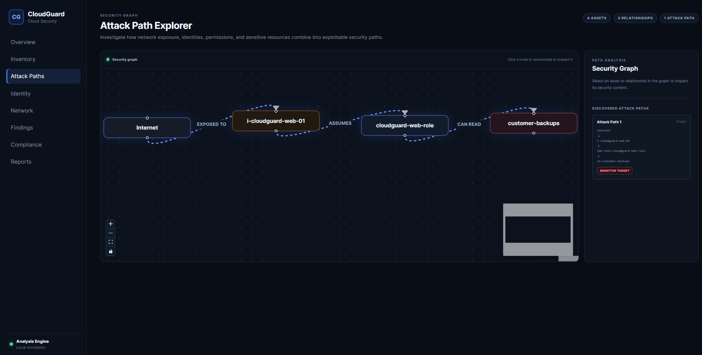
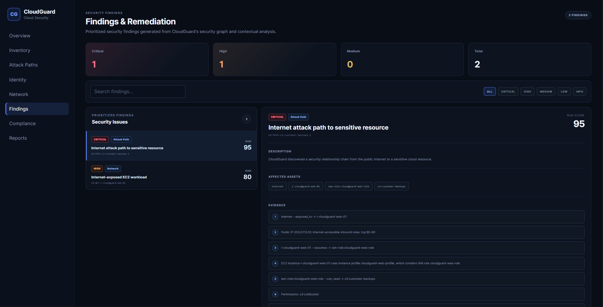
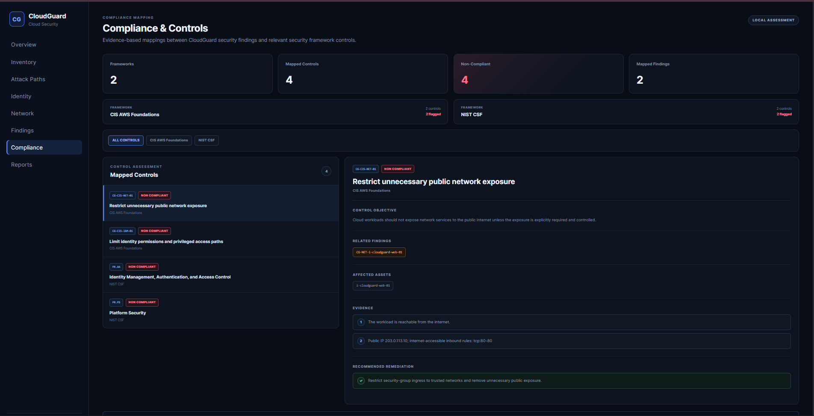

# ☁️ CloudGuard

### Cloud Security Intelligence & Attack-Path Analysis Platform

CloudGuard is a defensive cloud-security analysis platform that identifies cloud misconfigurations, analyzes identity and network exposure, models relationships between cloud resources, and discovers multi-step attack paths to sensitive assets.

Instead of treating security issues as isolated findings, CloudGuard correlates infrastructure, network exposure, IAM relationships, permissions, and sensitive resources into a security graph.

```text
Internet → EC2 Instance → IAM Role → Sensitive S3 Bucket
```

This allows CloudGuard to answer a more important security question:

> **What can potentially be reached from an exposed cloud resource, through which security relationships, and why does that path matter?**

> **Current demo mode:** CloudGuard runs entirely locally using a simulated AWS environment. No AWS resources need to be deployed and no AWS charges are required.

---

## 📸 Dashboard



The overview provides an executive view of the current security posture, including asset inventory, attack paths, findings, severity distribution, and highest observed risk.

The current simulated environment identifies:

| Metric | Result |
|---|---:|
| Cloud Assets | 4 |
| Relationships | 3 |
| Sensitive Assets | 1 |
| Internet-Exposed Assets | 1 |
| Attack Paths | 1 |
| Findings | 2 |
| Highest Risk Score | 95/100 |

---

## 🔍 What CloudGuard Does

CloudGuard analyzes:

- Cloud assets
- Internet exposure
- Security-group configuration
- IAM roles and observed permissions
- Sensitive resources
- Resource relationships
- Multi-step attack paths
- Identity risk
- Network risk
- Contextual findings
- Compliance mappings
- Security reports
- Explainable attack paths
- Structured remediation recommendations
- Remediation prioritization by simulated impact
- Read-only remediation simulation

The analysis results are exposed through a FastAPI REST API and an interactive React/TypeScript dashboard.

---

## 🧠 Core Security Concept

A traditional cloud-security scanner may identify:

```text
EC2 instance is publicly reachable
```

CloudGuard goes further by correlating that exposure with other relationships:

```text
Internet
   │
   ▼
Public EC2 Instance
   │
   ▼
Attached IAM Role
   │
   ▼
Sensitive S3 Bucket
```

This transforms individual security conditions into an attack-path model that provides additional context about potential impact.

---

# 🏗️ Architecture

## System Architecture



CloudGuard uses a modular analysis pipeline that separates data collection, normalization, inference, graph construction, risk correlation, reporting, and presentation.

## Analysis Pipeline

```text
                 Cloud Security Data
                         │
                         ▼
                 ┌───────────────┐
                 │  Collectors   │
                 └───────┬───────┘
                         │
                         ▼
                 ┌───────────────┐
                 │ Normalization │
                 └───────┬───────┘
                         │
            ┌────────────┼────────────┐
            │            │            │
            ▼            ▼            ▼
         Network      IAM / Identity  Sensitive
         Analysis       Analysis      Resource
            │            │            Analysis
            └────────────┼────────────┘
                         │
                         ▼
                 ┌───────────────┐
                 │ Security Graph│
                 │   NetworkX    │
                 └───────┬───────┘
                         │
                         ▼
                 ┌───────────────┐
                 │ Attack Paths  │
                 └───────┬───────┘
                         │
                         ▼
                 ┌───────────────┐
                 │ Risk Engine   │
                 │  & Findings   │
                 └───────┬───────┘
                         │
              ┌──────────┼──────────┐
              │          │          │
              ▼          ▼          ▼
          Compliance   Reports    FastAPI
                                   API
                                    │
                                    ▼
                              React Dashboard
```

---

# ⚔️ Attack-Path Analysis

CloudGuard constructs a security graph in which cloud resources are represented as nodes and security-relevant relationships are represented as edges.

Examples include:

```text
Internet → EC2
EC2 → IAM Role
IAM Role → S3
```

NetworkX is used to represent and analyze these relationships.

## Attack Path Explorer



The current local security lab discovers:

```text
Internet
   ↓
i-cloudguard-web-01
   ↓
iam-role:cloudguard-web-role
   ↓
s3:customer-backups
```

This is a three-hop path from external exposure to a resource classified as sensitive.

Attack-path analysis is the central capability that distinguishes CloudGuard from a scanner that only lists independent configuration issues.

---

# 🛡️ Security Analysis

## Cloud Asset Inventory

CloudGuard creates a normalized representation of cloud resources.

Current resource types include:

- EC2 instances
- S3 buckets
- IAM roles
- Security groups
- Virtual Internet nodes

The data model is designed to support additional resource types such as:

- RDS
- Lambda
- VPC
- IAM users
- Secrets

---

## Network Exposure Analysis

CloudGuard evaluates contextual network-security conditions including:

- Public IP addresses
- Internet-accessible security-group rules
- Exposed workloads
- Identity relationships attached to exposed workloads
- Reachability of sensitive resources
- Participation in attack paths

The current simulated Internet-exposed EC2 workload receives a network risk score of:

```text
80 / 100 — HIGH
```

Risk is calculated from multiple contextual signals rather than public exposure alone.

---

## IAM & Identity Risk Analysis

CloudGuard correlates IAM identities with:

- Attached workloads
- Observed permissions
- Internet exposure
- Sensitive-resource access
- Discovered attack paths

This allows IAM risk to be considered in the context of the infrastructure using the identity.

> **IAM limitation:** CloudGuard currently analyzes permissions observed by its IAM model. It does not claim to calculate complete AWS effective permissions.

---

# 🚨 Findings & Risk Correlation



CloudGuard converts analysis results into prioritized security findings.

The current local lab demonstrates two findings.

### HIGH — Internet-Exposed EC2 Workload

```text
Risk Score: 80/100
```

The workload has Internet exposure and participates in a path toward a sensitive resource.

### CRITICAL — Attack Path to Sensitive Resource

```text
Risk Score: 95/100
```

The correlated path is:

```text
Internet
   ↓
EC2
   ↓
IAM Role
   ↓
Sensitive S3 Bucket
```

The distinction is important: CloudGuard can represent both an individual exposure and the broader security path created when that exposure is combined with identity and resource relationships.

---

# 🧭 Explainable Attack Paths

Every discovered attack path carries a structured explanation of **why** each hop exists:

```text
Internet
   │
   │ Security-group configuration allows public
   │ inbound traffic from the internet.
   │ (evidence: security group sg-cloudguard-web, tcp:80-80)
   ▼
EC2
   │
   │ Attached to IAM role through an instance profile.
   ▼
IAM Role
   │
   │ IAM policy grants s3:GetObject, s3:ListBucket.
   ▼
Sensitive S3 Bucket
```

Each hop exposes:

- relationship type
- human-readable reason
- evidence recorded at detection time
- the configuration responsible for the relationship
- the security impact of that step

Explanations are derived only from configuration CloudGuard actually detected. CloudGuard does not claim exploitability beyond the relationships it can show.

---

# 🛠️ Remediation & Simulate Fix

CloudGuard converts supported findings into **structured remediation recommendations**:

- remediation ID, title, description
- affected resources, findings, attack paths, and relationships
- evidence and manual steps
- expected effect

Current supported conditions:

| Condition | Recommendation |
|---|---|
| Public internet exposure (`exposed_to`) | Restrict the offending security-group ingress |
| IAM write access to a sensitive resource (`can_write`) | Reduce the granted permissions to least privilege |

## Remediation Prioritization

Remediations are ranked by **simulated impact**, not severity labels:

1. attack paths eliminated (descending)
2. absolute risk-score reduction (descending)
3. remediation ID (deterministic tie-break)

The risk score is CloudGuard's **prioritization score**. It is not a statistical probability.

## Simulate Fix

`POST /api/remediations/{remediation_id}/simulate` evaluates a remediation against an **isolated in-memory copy** of the security graph:

```text
CURRENT STATE → DEEP COPY → VIRTUAL REMEDIATION
  → RECALCULATE PATHS/FINDINGS/RISK → BEFORE/AFTER DIFF
```

The response reports before/after highest risk, attack-path counts, removed paths, and absolute/percentage risk reduction. The `after` values are always recalculated from the simulated state — remaining findings keep their scores.

> **Simulation disclaimer:** CloudGuard simulation is predictive analysis based on CloudGuard's security model. It does **not** guarantee that a remediation eliminates every real-world attack vector. It does **not** modify AWS resources, and simulated changes are never persisted.

---

# 📋 Compliance Mapping



CloudGuard maps security evidence to selected security-control categories.

Current mappings include:

- NIST Cybersecurity Framework
- CloudGuard-specific CIS-oriented mappings

Current assessment states include:

```text
NON_COMPLIANT
NOT_ASSESSED
```

The local demonstration currently evaluates four mapped controls.

> Compliance mappings are evidence-based security mappings. They are **not certifications, attestations, or complete framework audits**.

CloudGuard-specific CIS-oriented identifiers should not be interpreted as official CIS numbered controls.

---

# 📄 Security Reporting

CloudGuard includes a reporting engine capable of producing both JSON and PDF security assessments.

Reports contain:

- Executive summary
- Asset statistics
- Security findings
- Risk scores
- Attack paths
- IAM risk
- Network exposure
- Compliance mappings
- Remediation guidance
- Assessment limitations

PDF generation is implemented using ReportLab.

Available reporting endpoints:

```text
GET /api/report
GET /api/report/pdf
```

---

# 🔐 API Security & Hardening

CloudGuard includes several backend security and reliability controls:

- Centralized exception handling
- Safe client-facing error responses
- Structured JSON logging
- Per-request UUID generation
- Request-duration logging
- HTTP security headers
- Controlled CORS configuration
- Frontend request timeouts
- Backend connection-failure handling
- Frontend retry functionality

Security headers include:

```text
X-Content-Type-Options
X-Frame-Options
Referrer-Policy
Permissions-Policy
Content-Security-Policy
```

Sensitive request values such as authorization credentials are not intentionally included in request logs.

---

# 🧪 Local Security Lab

CloudGuard includes a simulated AWS environment so the complete analysis pipeline can be demonstrated without deploying live cloud infrastructure.

The current lab contains:

```text
EC2 Instances:       1
Security Groups:     1
S3 Buckets:          1
IAM Roles:           1
Instance Profiles:   1
```

After normalization and analysis:

```text
Assets:              4
Relationships:       3
Sensitive Assets:    1
Internet Exposed:    1
Attack Paths:        1
Findings:            2
Highest Risk Score:  95/100
```

The primary demonstration path is:

```text
Internet
   │
   ▼
EC2: i-cloudguard-web-01
   │
   ▼
IAM Role: cloudguard-web-role
   │
   ▼
S3: customer-backups
```

The local lab makes it possible to demonstrate CloudGuard without incurring AWS infrastructure charges.

---

# 🖥️ Dashboard

The React dashboard provides dedicated views for:

- Overview
- Asset Inventory
- Attack Paths
- Identity & IAM Risk
- Network Exposure
- Findings
- Compliance
- Reports

The frontend communicates with the FastAPI backend through the CloudGuard REST API.

If the backend becomes unavailable, the frontend displays a controlled error state and provides a retry mechanism without requiring the entire application to be reloaded.

---

# 🧰 Technology Stack

## Backend

| Technology | Purpose |
|---|---|
| Python | Core security-analysis platform |
| FastAPI | REST API |
| Pydantic | Data validation and models |
| NetworkX | Security graph and attack paths |
| Uvicorn | ASGI server |
| Boto3 | AWS integration |
| ReportLab | PDF report generation |

## Frontend

| Technology | Purpose |
|---|---|
| React | Dashboard |
| TypeScript | Typed frontend development |
| Vite | Development/build tooling |
| React Router | Dashboard routing |
| XYFlow / React Flow | Graph visualization |

## Testing

- Pytest
- FastAPI TestClient
- HTTPX

## AWS-Oriented Components

CloudGuard contains collector and analysis components for:

- EC2
- IAM
- S3
- STS
- Security groups

The current demonstration operates in local simulation mode and does not require AWS API calls.

---

# 📁 Project Structure

```text
CloudGuard/
│
├── cloudguard/
│   ├── api/
│   │   ├── errors.py
│   │   ├── middleware.py
│   │   └── routes/
│   │
│   ├── collectors/
│   ├── compliance/
│   ├── findings/
│   ├── graph/
│   ├── inference/
│   ├── models/
│   ├── normalizers/
│   ├── reporting/
│   ├── services/
│   │
│   ├── local_lab.py
│   ├── local_scan.py
│   ├── logging_config.py
│   └── main.py
│
├── frontend/
│   ├── public/
│   └── src/
│       ├── components/
│       ├── pages/
│       ├── services/
│       └── types/
│
├── docs/
│   └── images/
│       ├── cloudguard-architecture.png
│       ├── cloudguard-overview.png
│       ├── cloudguard-attack-paths.png
│       ├── cloudguard-findings.png
│       └── cloudguard-compliance.png
│
├── lab/
├── tests/
├── requirements.txt
└── README.md
```

---

# 🚀 Installation

## Prerequisites

Install:

- Python 3.11+
- Node.js
- npm
- Git

Clone the repository:

```bash
git clone <your-repository-url>
cd CloudGuard
```

---

## Backend Setup

Create a virtual environment:

```bash
python -m venv .venv
```

### Windows PowerShell

Activate it:

```powershell
.\.venv\Scripts\Activate.ps1
```

Install the dependencies:

```bash
pip install -r requirements.txt
```

Start CloudGuard:

```bash
python -m uvicorn cloudguard.main:app --host 127.0.0.1 --port 8000 --reload
```

API:

```text
http://127.0.0.1:8000
```

FastAPI documentation:

```text
http://127.0.0.1:8000/docs
```

---

# 🌐 Frontend Setup

Keep the backend running and open a second terminal.

```powershell
cd frontend
npm install
npm run dev
```

Vite will display the dashboard URL.

Normally:

```text
http://localhost:5173
```

If the port is occupied, Vite may automatically select another port such as `5174`.

---

# ▶️ Running CloudGuard

During development, run the backend and frontend in separate terminals.

### Terminal 1 — Backend

```powershell
cd C:\path\to\CloudGuard
.\.venv\Scripts\Activate.ps1
python -m uvicorn cloudguard.main:app --host 127.0.0.1 --port 8000 --reload
```

### Terminal 2 — Frontend

```powershell
cd C:\path\to\CloudGuard\frontend
npm run dev
```

Then open the URL displayed by Vite.

---

# 🧪 Testing

Run the complete backend test suite from the project root:

```bash
python -m pytest -q
```

Current verified result:

```text
97 passed
```

The automated suite covers:

- Core security analysis
- API endpoints
- IAM risk analysis
- Network risk analysis
- Compliance mapping
- Reporting
- PDF generation
- Exception handling
- Security headers
- Structured request logging
- Request IDs
- API hardening

---

# 🔌 API Endpoints

| Endpoint | Purpose |
|---|---|
| `/api/health` | Service health |
| `/api/overview` | Security overview |
| `/api/assets` | Normalized cloud assets |
| `/api/relationships` | Security relationships |
| `/api/findings` | Security findings |
| `/api/attack-paths` | Discovered attack paths |
| `/api/identity-risks` | IAM and identity risk |
| `/api/network-risks` | Network exposure analysis |
| `/api/compliance` | Compliance mappings |
| `/api/remediations` | Structured remediation candidates |
| `/api/remediations/prioritized` | Remediations ranked by simulated impact |
| `/api/remediations/{id}/simulate` | Read-only remediation simulation |
| `/api/report` | JSON security assessment |
| `/api/report/pdf` | PDF security assessment |

---

# 🔒 Security Model

CloudGuard is designed as a **defensive cloud-security analysis platform**.

AWS collectors are intended to use read-only access where possible.

CloudGuard does not require modifying cloud resources to perform security analysis.

For demonstrations, the local security lab provides simulated AWS resources so the platform can operate without deploying live infrastructure.

---

# ⚠️ Current Limitations

## IAM Analysis

The IAM engine does not yet implement complete AWS effective-permission evaluation.

Future analysis may include:

- Inline policies
- Group policies
- Permission boundaries
- Service Control Policies
- Resource policies
- Explicit deny resolution
- `NotAction`
- `NotResource`
- Advanced IAM conditions

IAM results should therefore be described as **observed or analyzed permissions**, rather than complete AWS effective permissions.

## Cloud Coverage

Current analysis focuses primarily on:

- EC2
- IAM
- S3
- Security groups

The normalized asset and graph architecture is designed to support additional AWS services.

## Compliance

Compliance results represent mappings between CloudGuard security evidence and security-control concepts.

They are not:

- Certifications
- Attestations
- Formal audits
- Complete compliance assessments

---

# 🗺️ Roadmap

Potential future development includes:

- Expanded AWS service coverage
- More complete IAM effective-permission analysis
- Resource-policy evaluation
- Advanced attack-path algorithms
- Blast-radius analysis
- Risk-history tracking
- Finding suppression
- Finding lifecycle management
- Multi-account AWS analysis
- Additional compliance frameworks
- SARIF export
- Authentication
- Role-based dashboard access
- Containerized deployment
- CI/CD security testing
- Historical security trends
- Graph-query capabilities

---

# 🎯 Use Cases

CloudGuard can be used for:

- Cloud-security education
- Defensive security research
- AWS security-analysis experimentation
- Attack-path visualization
- IAM relationship analysis
- Network exposure analysis
- Security-control mapping
- Cybersecurity demonstrations
- Portfolio demonstrations

---

# ⚖️ Disclaimer

CloudGuard is intended for defensive security research, education, authorized cloud-security assessment, and portfolio demonstration.

Only analyze cloud environments that you own or are explicitly authorized to assess.

The included local simulation mode demonstrates CloudGuard without requiring live AWS infrastructure or incurring AWS resource charges.

---

# 📌 Project Status

**Status: Functional local cloud-security analysis platform**

Implemented capabilities include:

- Cloud asset normalization
- Security relationship modeling
- Network exposure analysis
- IAM risk analysis
- Sensitive-resource classification
- Graph-based attack-path discovery
- Contextual risk scoring
- Prioritized security findings
- Compliance mappings
- FastAPI REST API
- React/TypeScript dashboard
- Interactive attack-path visualization
- Explainable attack paths (per-hop reason, evidence, configuration, impact)
- Structured remediation recommendations
- Remediation prioritization by simulated impact
- Read-only remediation simulation with before/after risk analysis
- JSON security reports
- PDF security reports
- Structured logging
- Request IDs
- HTTP security headers
- Controlled API error handling
- Frontend API resilience
- Automated security and API tests

**Current verified automated test result: `97 passed`**

Further development will focus on expanding cloud-service coverage, analysis depth, and production-oriented capabilities.